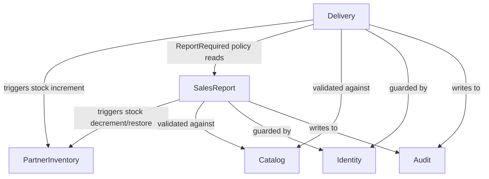

# Bounded Contexts — Bookflow Core

This document describes the **bounded contexts** of the Bookflow domain, their invariants, key objects, business rules, and the dependencies between them.

---

## Overview

```
┌─────────────────────────────────────────────────────────────────────────┐
│                         Bookflow Domain                                  │
│                                                                          │
│  ┌──────────────────────┐         ┌───────────────────────────────────┐  │
│  │      Delivery         │────────▶│         SalesReport               │  │
│  │  (DeliveryRequest)    │         │      (SalesReport)                │  │
│  └──────────────────────┘         └───────────────────────────────────┘  │
│            │                                    │                        │
│            └──────────────────┬─────────────────┘                        │
│                               ▼                                          │
│                  ┌─────────────────────────┐                             │
│                  │    PartnerInventory      │                             │
│                  │  (StockProjection)       │                             │
│                  └─────────────────────────┘                             │
│                                                                          │
│  ── Cross-cutting: Identity (roles), Audit, Catalog ──────────────────  │
└─────────────────────────────────────────────────────────────────────────┘
```

---

## Context 1 — Delivery

**Module:** `domain/delivery_request.py`, `app/use_cases.py` (DR use cases), `policies/active_delivery_request.py`, `policies/report_required.py`

### Purpose

Manages the lifecycle of a book **delivery request** from a partner to the platform.

### Key Objects

| Object | Type | Description |
|--------|------|-------------|
| `DeliveryRequest` | Aggregate root | Represents a request for books to be delivered to a partner |
| `RequestItem` | Value object | A line item: `book_id` + `quantity` |
| `Status` | Enum | `DRAFT → SUBMITTED → APPROVED / REJECTED → DELIVERED` |

### Invariants

- A `DeliveryRequest` must have at least one item.
- Each `book_id` in a request must be unique (no duplicates).
- Every quantity must be positive (`> 0`).
- Total quantity across all items must be **≥ 2**.
- `partner_id` is mandatory.
- Status transitions are strictly enforced:
  - `SUBMITTED` only from `DRAFT`
  - `APPROVED` only from `SUBMITTED`
  - `REJECTED` only from `SUBMITTED`
  - `DELIVERED` only from `APPROVED`

### Business Rules

| Rule | Enforcement point |
|------|-------------------|
| Only a `PARTNER` can create or submit a delivery request | `use_cases.create_delivery_request`, `use_cases.submit_delivery_request` |
| Only an `ADMIN` can approve, reject, or mark as delivered | `use_cases.approve/reject_delivery_request`, `use_cases.mark_delivered` |
| A partner cannot have more than one active (SUBMITTED or APPROVED) request at a time | `policies/active_delivery_request.py` |
| A partner must have submitted a sales report since their last delivery before starting a new delivery cycle | `policies/report_required.py` |
| All `book_id` values in a request must exist in the global catalog | `policies/validations.py` |
| Rejection requires a non-empty reason; the rejection event is audit-recorded atomically | `use_cases.reject_delivery_request` |

### Use Cases

`CreateDR` · `SubmitDR` · `ApproveDR` · `RejectDR` · `DeliverDR` · `GetDR`

### State Machine

```
          create
DRAFT ──────────────▶ DRAFT
  │
  │ submit
  ▼
SUBMITTED ──── approve ──▶ APPROVED ──── deliver ──▶ DELIVERED
     │
     └──── reject ──▶ REJECTED
```

---

## Context 2 — SalesReport

**Module:** `domain/sales_report.py`, `app/use_cases.py` (SR use cases)

### Purpose

Records book sales made by a partner from their delivered stock. A report can be voided (cancelled) by an admin.

### Key Objects

| Object | Type | Description |
|--------|------|-------------|
| `SalesReport` | Aggregate root | A partner's declaration of sales for a period |
| `ReportItem` | Value object | A line item: `book_id` + `quantity` |

### Invariants

- A `SalesReport` must have at least one item.
- Each `book_id` in a report must be unique (no duplicates).
- Every quantity must be positive (`> 0`).
- Total quantity across all items must be **≥ 2**.
- `partner_id` is mandatory.
- A report that is already voided cannot be voided again (`AlreadyVoided`).

### Business Rules

| Rule | Enforcement point |
|------|-------------------|
| Only a `PARTNER` can submit a sales report | `use_cases.submit_sales_report` |
| Only an `ADMIN` can void a sales report | `use_cases.void_sales_report` |
| All `book_id` values must exist in the global catalog | `policies/validations.py` |
| Reported quantities must not exceed the partner's available stock | `PartnerInventory.report_sale` |
| Voiding requires a non-empty reason; the void event is audit-recorded atomically | `use_cases.void_sales_report` |

### Use Cases

`SubmitSR` · `VoidSR` · `GetSR`

---

## Context 3 — PartnerInventory (Stock)

**Module:** `domain/partner_inventory.py`, `infra/sql/sql_partner_inventory_repo.py`, `policies/stock_projection.py`

### Purpose

Tracks the **current stock** held by each partner for each book SKU. It is the authoritative source for stock enforcement and is updated transactionally alongside delivery and sales report operations.

### Key Objects

| Object | Type | Description |
|--------|------|-------------|
| `PartnerInventory` | Entity | Stock level for one `(partner_id, book_sku)` pair |

### Invariants

- `current_quantity` is always **≥ 0** (enforced at DB level and by `report_sale`).
- `version` is a monotonically increasing integer (optimistic concurrency marker).
- A sale cannot be reported if it would bring stock below zero (`InsufficientStock`).

### Business Rules

| Rule | Enforcement point |
|------|-------------------|
| Delivering a DR increments stock for each item atomically | `use_cases.mark_delivered` |
| Submitting a SR decrements stock for each item atomically | `use_cases.submit_sales_report` |
| Voiding a SR restores stock for each item atomically | `use_cases.void_sales_report` (via `helpers.restore_quantities_or_raise`) |

### Projection (read-only view)

`policies/stock_projection.py::compute_partner_stock` provides a **computed** view of stock by replaying delivered DRs minus non-voided SRs directly from the DB. This projection is used for policy checks in older code paths and is separate from the live `PartnerInventory` records.

---

## Cross-cutting Concerns

### Identity & Authorization

**Module:** `policies/identity.py`

| Concept | Description |
|---------|-------------|
| `Role` | `ADMIN` or `PARTNER` |
| `Actor` | Carries `role` and (for partners) `partner_id` |
| `Forbidden` | Raised when an actor lacks permission |

Invariants:
- A `PARTNER` actor must have a `partner_id`.
- An `ADMIN` actor must **not** have a `partner_id`.

### Audit

**Module:** `infra/sql/sql_audit_repo.py`, used in `app/use_cases.py`

The audit log records significant domain events (`DR_REJECTED`, `SR_VOIDED`) with their `target_type`, `target_id`, and `reason`. Audit writes are always performed inside the same DB transaction as the state change they describe.

### Catalog

The **catalog** is an `Iterable[str]` of valid `book_id` values injected into the `Context`. It acts as a global reference list shared across the Delivery and SalesReport contexts. Both `validate_request_items_in_catalog` and `validate_report_items_in_catalog` rely on it.

---

## Context Dependencies



### Dependency summary

| Context | Depends on | Direction |
|---------|-----------|-----------|
| Delivery | Identity, Catalog, Audit, SalesReport (policy), PartnerInventory | Delivery → others |
| SalesReport | Identity, Catalog, Audit, PartnerInventory | SalesReport → others |
| PartnerInventory | _(none — updated by Delivery and SalesReport)_ | Passive target |
| Catalog | _(none — external configuration)_ | Pure input |
| Identity | _(none)_ | Pure input |
| Audit | _(none — append-only log)_ | Pure output |

---

## Potential Issues & Observations

### Coupling between Delivery and SalesReport

The `ReportRequired` policy in `policies/report_required.py` queries `sales_reports` directly from the Delivery context's use cases. This creates an **explicit cross-context dependency**. It is intentional (the rule *is* cross-context), but it means the Delivery context cannot evolve without awareness of the SalesReport schema.

**Suggestion:** Consider introducing an anti-corruption layer or a domain event (`DeliveryCompleted`) that the SalesReport context could react to, rather than a direct DB query from Delivery.

### Dual stock-checking mechanisms

Stock is enforced by two separate mechanisms:
1. **Live `PartnerInventory` records** — updated transactionally, used in `submit_sales_report`.
2. **`compute_partner_stock` projection** — a read-only SQL aggregation, kept in `policies/stock_projection.py` for legacy/read use cases.

Both should always agree, but they are not the same code path. Keeping both in sync is a maintenance concern.

### Catalog as injected configuration

The catalog is not a domain object — it is injected as a plain `Iterable[str]`. If catalog management grows in complexity (versioning, per-partner allowlists, etc.), it may warrant its own bounded context.
